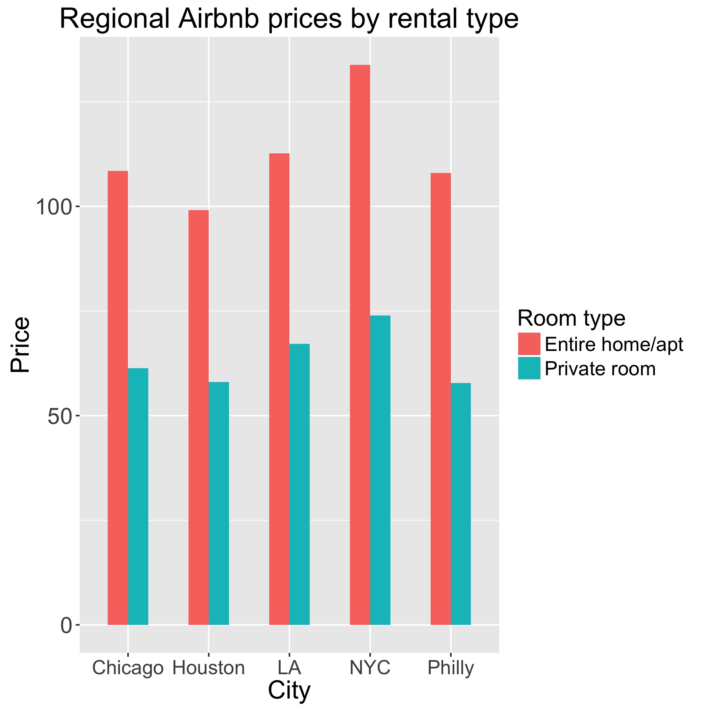
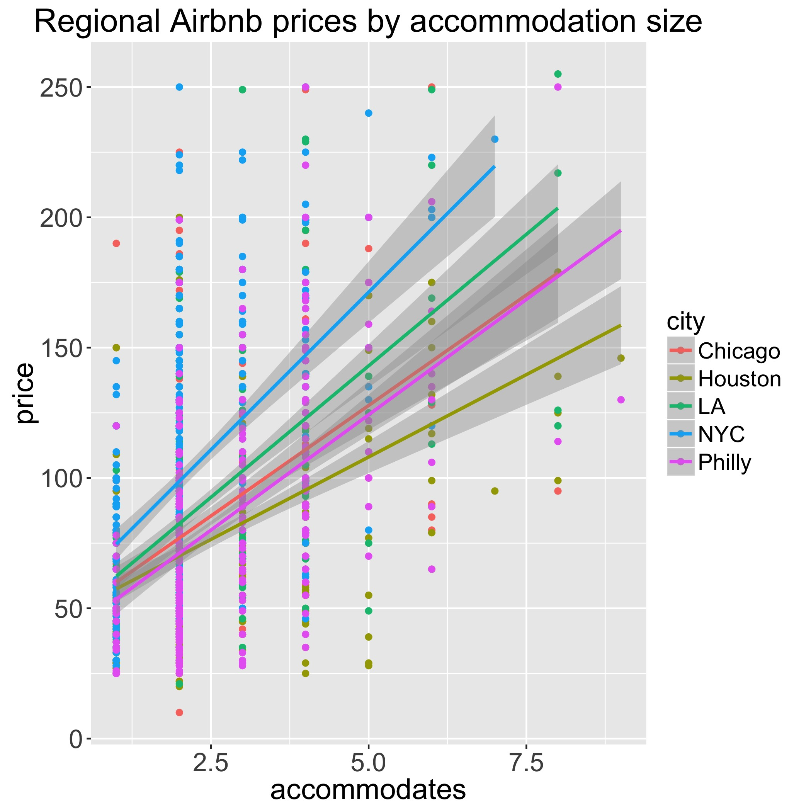
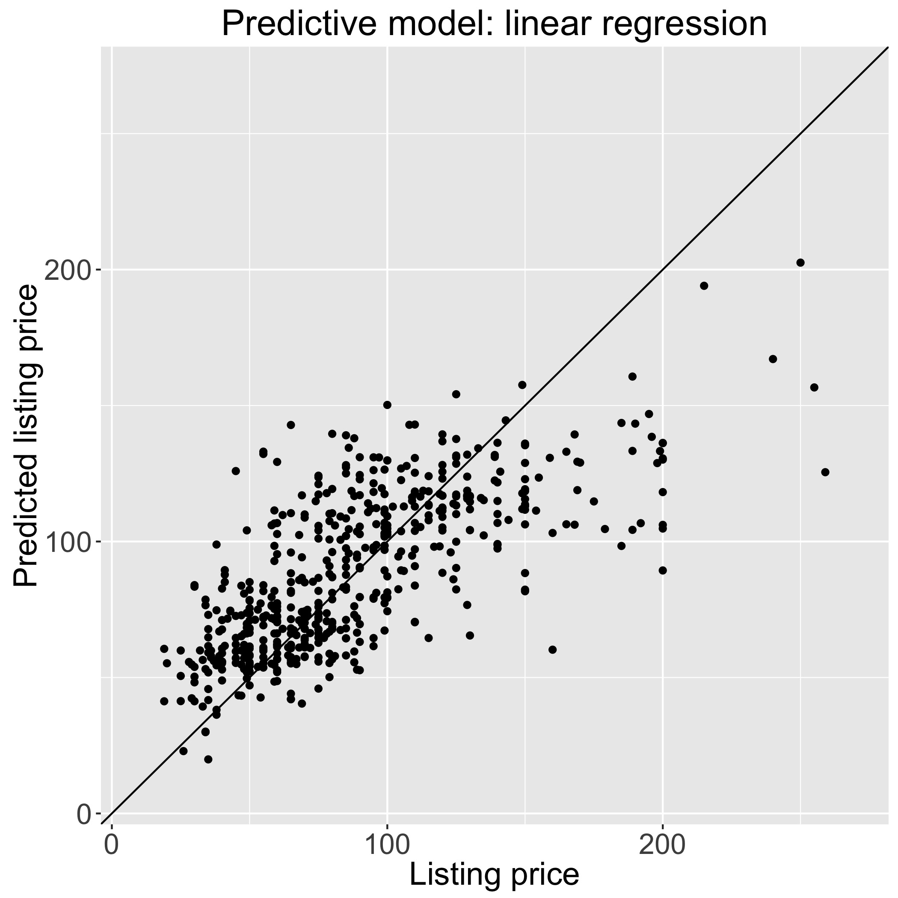

## Scrape and model airbnb listings

This repo contains some functions for scraping and cleaning apartment listings from the visible front end of airbnb.com, and some code exploring and modeling how the rental features relate to price.

### Scraping

The file **airbnbScrape.R** contains the function scrapeAirbnb(), which takes a string argument for city (format matching url for airbnb city searches, e.g. "New-York--NY"), number of pages to scrape (airbnb lists a max of 17 pages), whether to write to file, and rental type ("entire", "private", "all"). 

```R
dat <- scrapeAirbnb("Taos--NM", aptType="private")
```

The returned data frame may have duplicate listings. These can be removed with the function cleanAirbnb(). Pass this function the directory of files to clean. The function also optionally removes extreme outliers (less than Q1 - 3 * IQR, greater than Q3 - 3 * IQR), and splits the data into training and testing files for predictive modeling (these files are written into a subdirectory of the passed path called trnTstData). 
 
```R
trnDat <- cleanAirbnb("data", removeOutliers = F, trainingProp = 0.75)
```
 
### Exploration

I scraped airbnb listings for the 5 biggest cities in the US: NYC, LA, Chicago, Houston, and Philadelphia. The file **airbnbExplore.R** contains code exploring the relationship of different listing features to price (2207 listings after cleaning and removal of 550 as a test set). 

This exploration showed that key listing features related to price are: city, rental type, and number of people that a listing could accommodate. Plotted below are the relationships of these variables to price. 

The figure below shows average price by city and rental type. Rentals of an entire space command a higher price than private rooms, and price overall roughly tracks the size of the city. 



The figure below shows prices by the number of people a listing accommodates. Price increases linearly with accommodation size, and this slope varies somewhat by city, with NYC showing the biggest increases in price with increases in accommodation size.



### Prediction

I created two types of predictive model of Airbnb listing prices: 1. a regression model, 2. a random forest model (see **predictAirbnb.R**). The parameters of these models were learned using k-fold cross validataion (k=10) on a training data set (random 80% of data), and tested on a held out testing set (remaining 20% of data). 
 
Several sets of features were used for different iterations of the linear regression model. Ratings (average stars, number of reviews) did not prove to be useful features for predicting listing price, nor did the moderating effects of city observed in the plots above. The following features related notably to listing price: city, accommodation size, room type, number of bedrooms, property type, city centered latitude and longitude, and whether the renter had multiple listings. This model explained 51% of price variance in the testing set (RMSE = 29.2). The plot below shows the pricing predictions of this model relative to the observed prices on the testing set (diagonal line references perfect prediction).



The random forest model used all features in the regression model and additionally number of reviews, average stars, and number of beds (the correlation of the latter with accommodation size does not pose the same problem here as in the regression model). This model had a minimum node size of 5 and 1000 trees. I searched across the number of variables for the best number available for splitting at each node for the choice associated with the smallest RMSE (mtry=3). This model narrowly outperforms linear regression, explaining 54% of the variance (pseudo-R^2) in the test set (RMSE = 28.7). 


Both models suffer from notable underprediction for higher price listings. The sample is less dense here (prices are right skewed), perhaps accounting for some of the error. Predictive models of price may be improved with more training data across the range of prices, and potentially with more, and better, listing features (e.g. ammenities, minimum night stay, distance from transportation, reviews on apartment attributes such as the accuracy of ad, communication, cleanliness, etc.).


